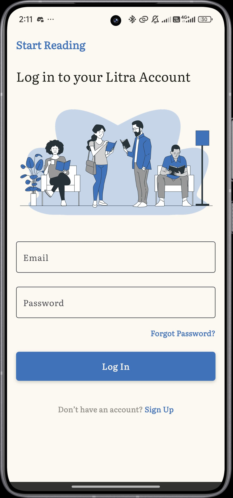
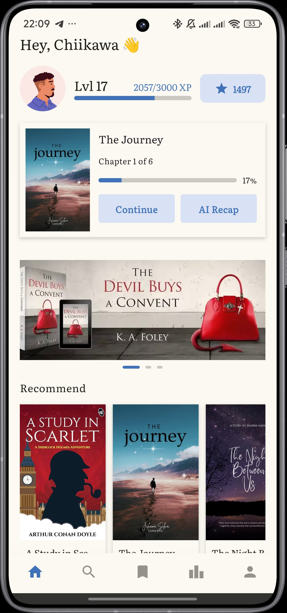
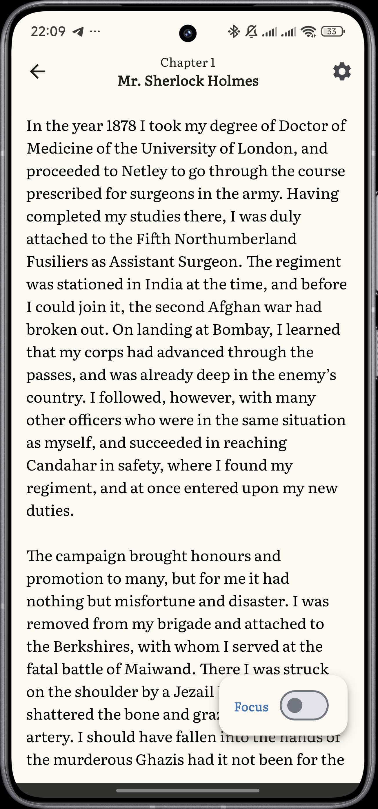
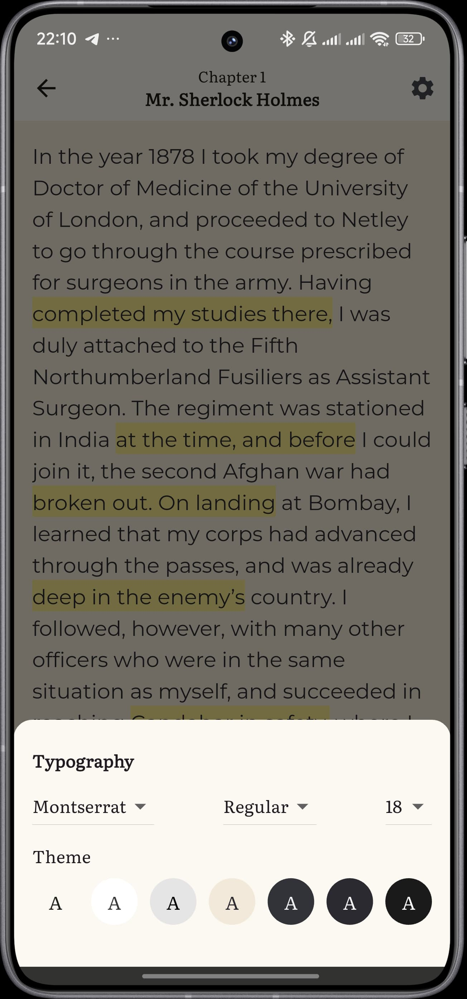
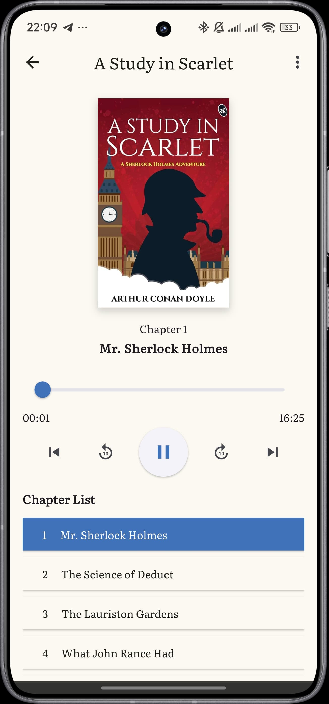
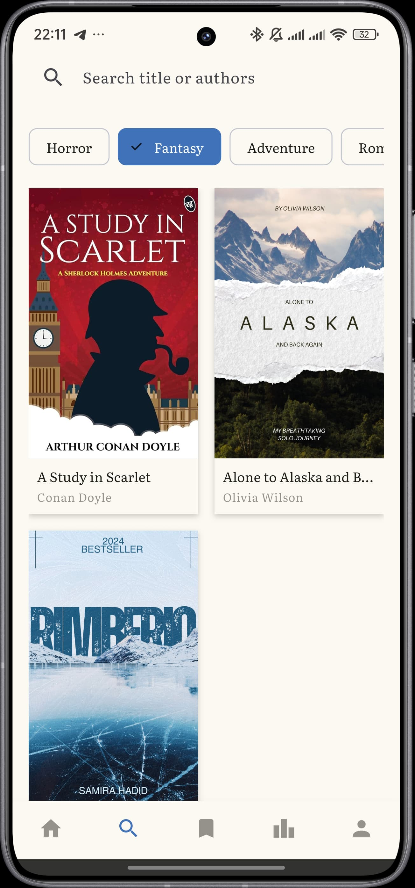
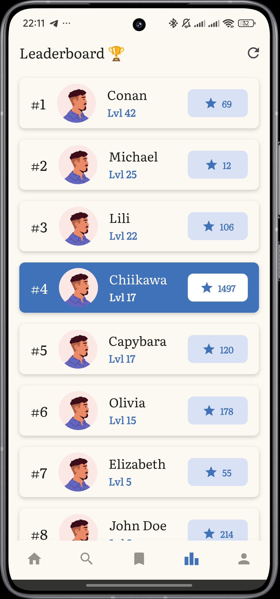
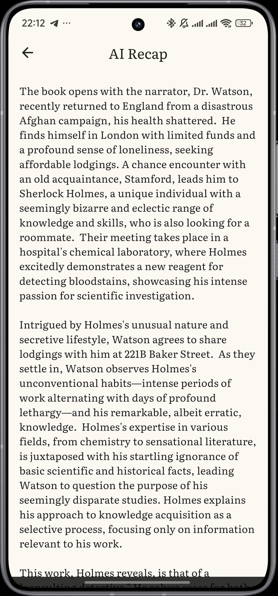
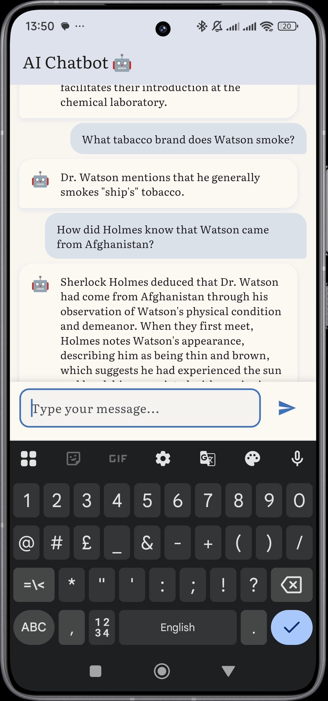

## LITRA
#### Gamify Your Reading - Make Books as Fun as Games!
**By ultratehmanis:**
* Hustler - Celine Yovela 
* Hacker - Kisusherly Annelise 
* Hipster - Joyce Velensia

 

Litra adalah aplikasi berbasis gamifikasi yang dirancang untuk meningkatkan minat baca, khususnya bagi penghidap ADHD _(Attention Deficit Hyperactivity Disorder)_. Litra diharapkan dapat membantu pengguna membangun kebiasaan membaca dengan pengalaman yang menyenangkan. 

## Fitur Utama
* ⭐ **Sistem Poin & Level** - Dapat poin dan XP setiap selesai membaca/mendengar buku.
* 🏆 **Leaderboard** - Kompetisi sehat dengan peringkat global.
* 🎯 **Focus Mode** - Aktifkan mode _Do Not Disturb_ dan Pomodoro Timer untuk meminimalkan distraksi.
* 📌 **Highlight Text** - Sorot bagian yang penting pada buku.
* ⚙️ **Customized Font & Background** - Atur tampilan text dan latar belakang sesuai preferensi.
* 📝 **AI Recap** - Ringkasan otomatis untuk membantu mengingat kembali isi buku.
* 🤖 **AI Chatbot** - Memahami lebih dalam tentang isi buku yang telah dibaca

## Instalasi
Unduh File 'Litra.apk' dari repositori di atas ke HP Android.

## Screenshots
&nbsp;&nbsp;
&nbsp;&nbsp;
&nbsp;&nbsp;

## Backup Links

* [Drive Folder](https://drive.google.com/drive/folders/19kcuwErtT50QEb3hiMleu8uwWjiPfyGV?usp=drive_link)
* [Apk](https://drive.google.com/file/d/1woXjaxYH5HqwtFvug1DJkgdIpmAd9mth/view?usp=drive_link)
* [Video Demo Aplikasi](https://drive.google.com/file/d/10FpPHk4xhx1F6VFbNgu4AirndpCT4Djd/view?usp=drive_link) 
* [Pitch Deck](https://drive.google.com/drive/folders/1dZuaMKgspiWh9cNzJLk312ihBZJL5-uA?usp=sharing)

